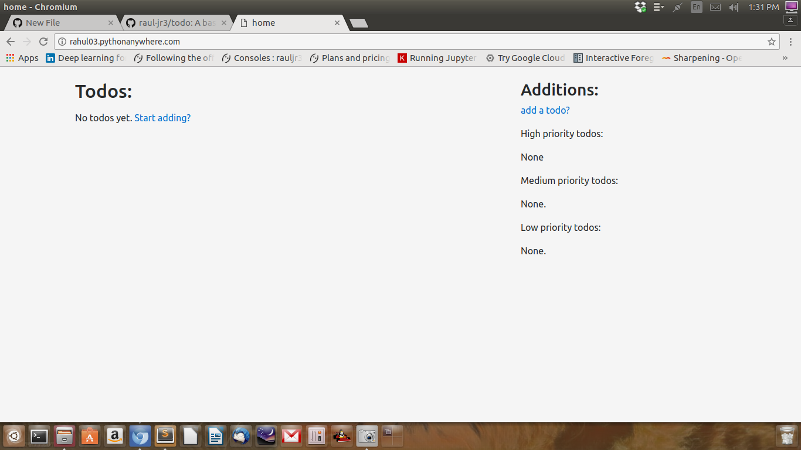

# todo
**A basic to-do app**

<h1>Requirements:</h1>
<ul>
  <li><b>Django 1.11.3</b></li>
  <li><b>bootstrap 4</b></li>
  <li><b>django crispy forms</b></li>
  <li><b>Pillow 4.2.0</b></li>
</ul>

Create a virtual environment and activate it.

Clone the repository into that environment and configure the settings.py file if required.

Install django crispy-forms using <b><code>pip install --upgrade django-crispy-forms</code></b>

and then install pillow using <b><code>pip install pillow</code></b>

Run <b><code>python manage.py makemigrations todo_app</code></b>

and then run <b><code>python manage.py migrate</code></b>

Then run <b><code>python manage.py runserver</code></b> and navigate to http://localhost:8000

<h3>This project assumes that the database used is sqlite.</h3>

<b>If you want to use a different database like PostgreSQL or MySQL then make changes in the settings.py file and then run the migrations accordingly.</b>
